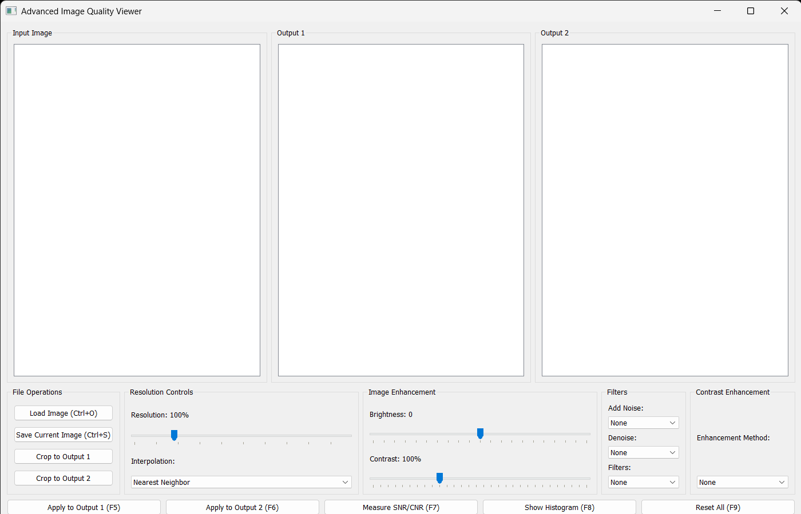
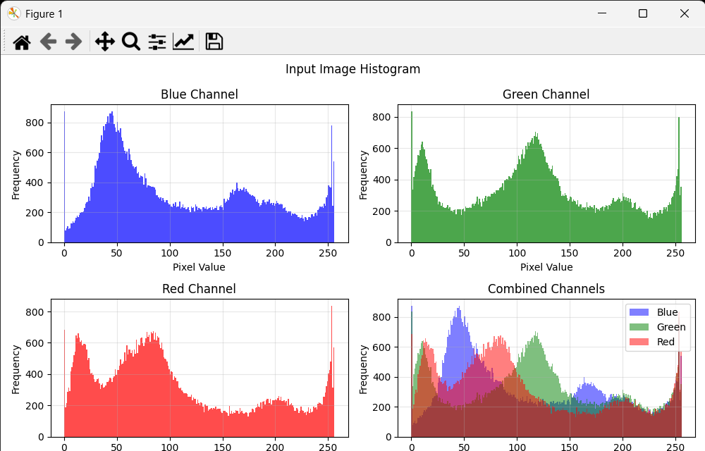
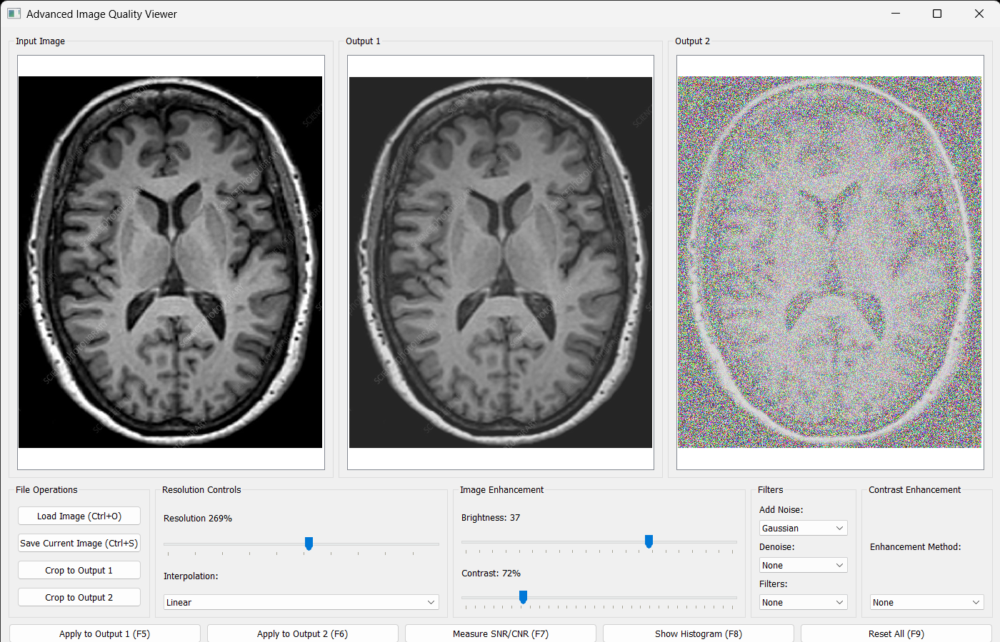
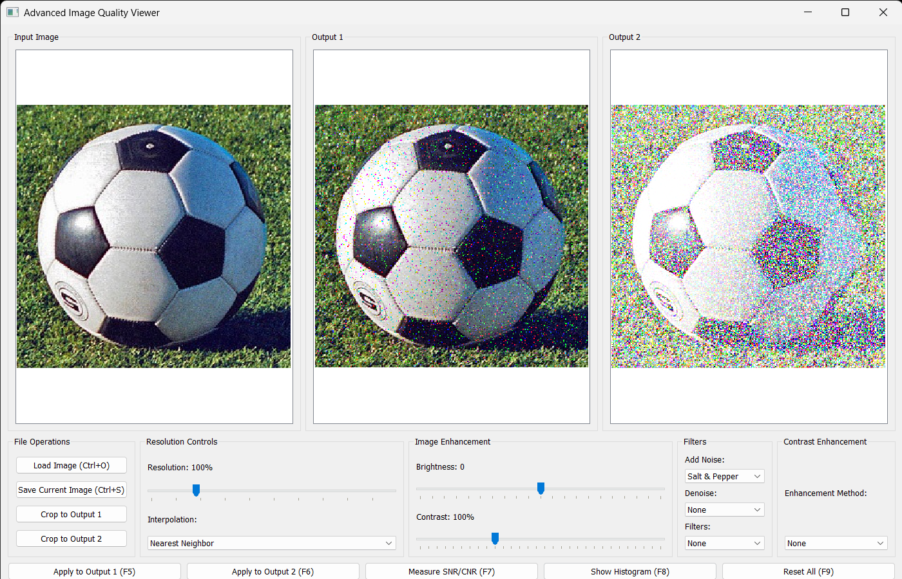

# Advanced Image Quality Viewer

The **Advanced Image Quality Viewer** is a PyQt5-based desktop application for visualizing and enhancing image quality. It offers a variety of tools, including zooming, contrast adjustment, noise addition/removal, and SNR/CNR measurement, along with support for cropping and saving images.

## Features

1. **Image Display**: Load and display grayscale or color images in three views: Input, Output 1, and Output 2.
2. **Zoom and Pan**: Use Ctrl + Mouse Wheel for zooming; drag to pan.
3. **Brightness and Contrast Adjustment**: Fine-tune image brightness and contrast with sliders.
4. **Noise Manipulation**: Add Gaussian, Salt & Pepper, or Speckle noise to images.
5. **Denoising Filters**: Apply Median, Gaussian, or Non-local Means filtering.
6. **Frequency Filters**: Use lowpass or highpass filters to modify images.
7. **Histogram Visualization**: View grayscale and RGB histograms for loaded images.
8. **Contrast Enhancement**: Choose from Histogram Equalization, CLAHE, or custom stretching.
9. **ROI Selection**: Select regions of interest for cropping or SNR/CNR measurements.
10. **Keyboard Shortcuts**: Enhance productivity with hotkeys for common operations.
11. **Saving Images**: Save processed images in various formats.

## Installation
# Advanced Image Quality Viewer

The **Advanced Image Quality Viewer** is a PyQt5-based desktop application for visualizing and enhancing image quality. It offers a variety of tools, including zooming, contrast adjustment, noise addition/removal, and SNR/CNR measurement, along with support for cropping and saving images.



## Features

1. **Image Display**: Load and display grayscale or color images in three views: Input, Output 1, and Output 2.

2. **Zoom and Pan**: Use Ctrl + Mouse Wheel for zooming; drag to pan.

3. **Brightness and Contrast Adjustment**: Fine-tune image brightness and contrast with sliders.

4. **Histogram Visualization**: View grayscale and RGB histograms for loaded images.

   


Here's the final version of the README.md with placeholders for screenshots:

markdown
Copy
Edit
# Advanced Image Quality Viewer

The **Advanced Image Quality Viewer** is a PyQt5-based desktop application for visualizing and enhancing image quality. It offers a variety of tools, including zooming, contrast adjustment, noise addition/removal, and SNR/CNR measurement, along with support for cropping and saving images.


## Features

1. **Image Display**: Load and display grayscale or color images in three views: Input, Output 1, and Output 2.

   

2. **Zoom and Pan**: Use Ctrl + Mouse Wheel for zooming; drag to pan.

   

3. **Brightness and Contrast Adjustment**: Fine-tune image brightness and contrast with sliders.

4. **Noise Manipulation**: Add Gaussian, Salt & Pepper, or Speckle noise to images.

   

5. **Histogram Visualization**: View grayscale and RGB histograms for loaded images.

   

6. **ROI Selection and Analysis**: Select regions of interest for cropping or SNR/CNR measurements.

   

7. **Saving Images**: Save processed images in various formats.

## Installation

### Requirements

- Python 3.x
- Required libraries: `PyQt5`, `numpy`, `opencv-python`, `matplotlib`

### Steps

1. Clone this repository:
   ```bash
   git clone https://github.com/your-repository/advanced-image-viewer.git
   cd advanced-image-viewer
Install dependencies:

bash
Copy
Edit
pip install -r requirements.txt
Run the application:

bash
Copy
Edit
python Image Quality Viewer.py
Usage
Load an Image:

Click "Load Image" or use Ctrl+O.
Supported formats: .png, .jpg, .bmp, .tif, .jpeg.
Enhance Images:

Adjust brightness, contrast, and zoom via sliders.
Apply noise or filters from dropdown menus.
ROI Operations:

Left-click and drag to select ROIs.
Use SNR/CNR tools to analyze selected areas.
Save Images:

Click "Save Current Image" or use Ctrl+S.
Shortcuts:

F5 and F6: Apply settings to Output 1 and Output 2.
F7: Measure SNR/CNR.
F8: Show histogram.
F9: Reset settings.
Keyboard Shortcuts
Shortcut	Action
Ctrl + O	Load an image
Ctrl + S	Save the current image
F5	Apply enhancements to Output 1
F6	Apply enhancements to Output 2
F7	Measure SNR/CNR for selected ROIs
F8	Show image histogram
F9	Reset all settings
Future Enhancements
Batch image processing.
Support for additional image formats.
Improved UI responsiveness.
