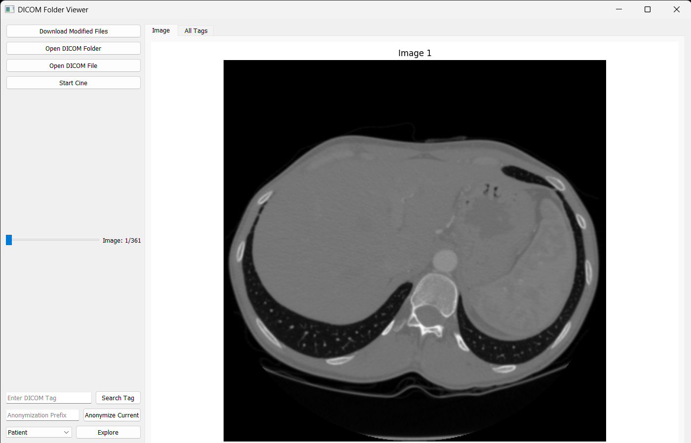
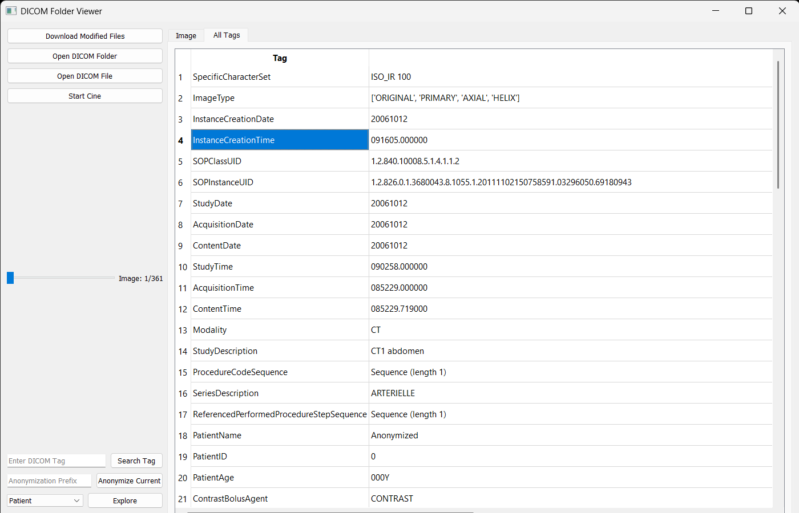
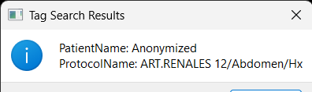

# DICOM Viewer 📁🩺

## 🖥️ Overview
The **DICOM Folder Viewer** is a PyQt5-based application for loading, exploring, and managing DICOM medical imaging data. It provides advanced functionalities like image visualization, metadata exploration, multi-frame DICOM handling, and anonymization of sensitive patient information.

---

## ✨ Features
- **DICOM Folder Exploration**:
  - Load and view DICOM images from a folder or individual files.
  - Explore DICOM metadata, such as patient, study, and modality information.
    
- **Image Display and Manipulation**:
  - Zoom and pan functionality for better visualization.
  - Multi-frame DICOM support with cine mode (auto-play).
- **Tile View**:
  - Display thumbnails of all images in a folder for quick navigation.
   
- **Metadata Search**:
  - Search for specific DICOM tags in the metadata.
  
- **Anonymization**:
  - Anonymize sensitive DICOM data using custom prefixes.
- **Download Modified Files**:
  - Save modified or anonymized DICOM files to a specified folder.

---

## 🛠️ Requirements
To run this project, you need:
- **Python 3.7+**
- Libraries:
  - `pydicom`
  - `PyQt5`
  - `matplotlib`
  - `faker`
  - `numpy`

Install dependencies using:
```bash
pip install pydicom PyQt5 matplotlib faker numpy
