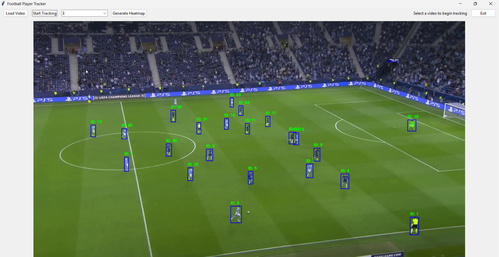
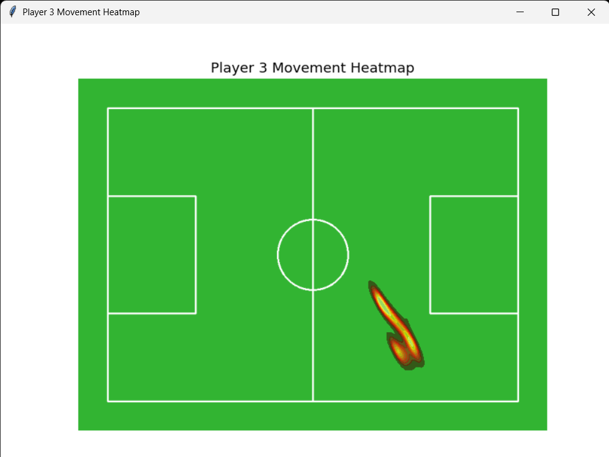

# Football Player Tracker with YOLOv5 🏃‍♂️⚽

## 🖥️ Overview
The **Football Player Tracker** is an advanced tool designed to track football players in real-time using the YOLOv5 object detection model. It features a user-friendly GUI for seamless interaction, heatmap generation, and movement tracking of individual players.

---

## ✨ Features
- **Real-Time Player Tracking**:
  - Detects and tracks players in a video using bounding boxes.
  
- **Player Movement Heatmap**:
  
  - Generate heatmaps to visualize individual player movement on the field.
- **Interactive GUI**:
  - Load videos, select players, and control tracking with ease.
- **Custom Field Visualization**:
  - Displays a football field with accurate dimensions for better context.

---

## 🛠️ Requirements
To run this project, you'll need:
- **Python 3.7+**
- Libraries:
  - `torch`
  - `cv2` (OpenCV)
  - `numpy`
  - `tkinter`
  - `matplotlib`
  - `seaborn`
  - `Pillow`

Install dependencies using:
```bash
pip install torch opencv-python numpy matplotlib seaborn Pillow
