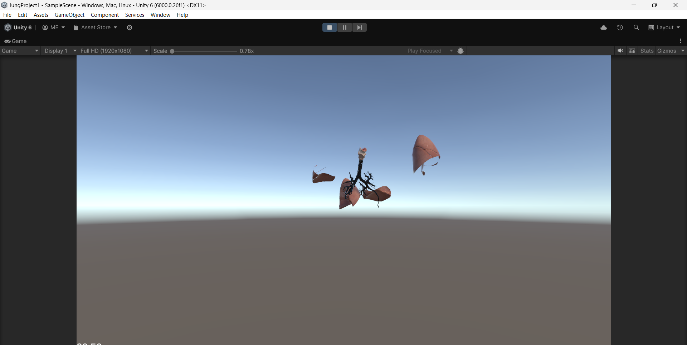

# Unity 3D Lung Assembly Game
A Unity-based 3D educational game where players learn about the anatomy of the lungs by assembling a detailed lung model. The game challenges players to correctly build the lung from its components, unlocking an interactive and educational experience.

Features
1-Interactive Gameplay: Drag and drop lung parts into the correct positions to complete the model.
2-Educational Focus: Learn the anatomy and function of the human lung through a fun and engaging activity.
3-Winning Condition: Successfully assemble the lung to win and receive an informative summary of lung anatomy.
4-Realistic 3D Models: Detailed representations of lung components for an immersive experience.
### Getting Started
Prerequisites
Unity 2021.3.x or newer
Basic understanding of Unity and C# scripting
## Installation

Open the project in Unity:

Launch Unity Hub.
Click on "Open Project."
Navigate to the project directory and select it.
Set up the environment:

  Open the MainScene in the Assets/Scenes/ folder.
  Play the game:
  
  Press the Play button in Unity's Editor to start testing the game.
  ## How to Play
  Start the game: Load the main menu and click "Start Game."
  Assemble the lungs:
  Drag parts of the lung into their correct positions.
  Use visual cues or hints if enabled.
  Complete the model: Place all parts correctly to win.
  Educational Summary: View an educational overview of the lung structure and functions after winning.
  Game Design
  Objective: Reinforce knowledge about lung anatomy in an interactive manner.
  Visual Feedback: Players receive feedback on correct or incorrect placements.
  Difficulty Options: Adjust the level of difficulty through hints and time limits (if implemented).
  Contributing
  We welcome contributions to improve the game's mechanics, design, or educational content. Please fork the repository and submit a pull request.

## ScreenShots
### Screen1

### Screen2

### Complete

